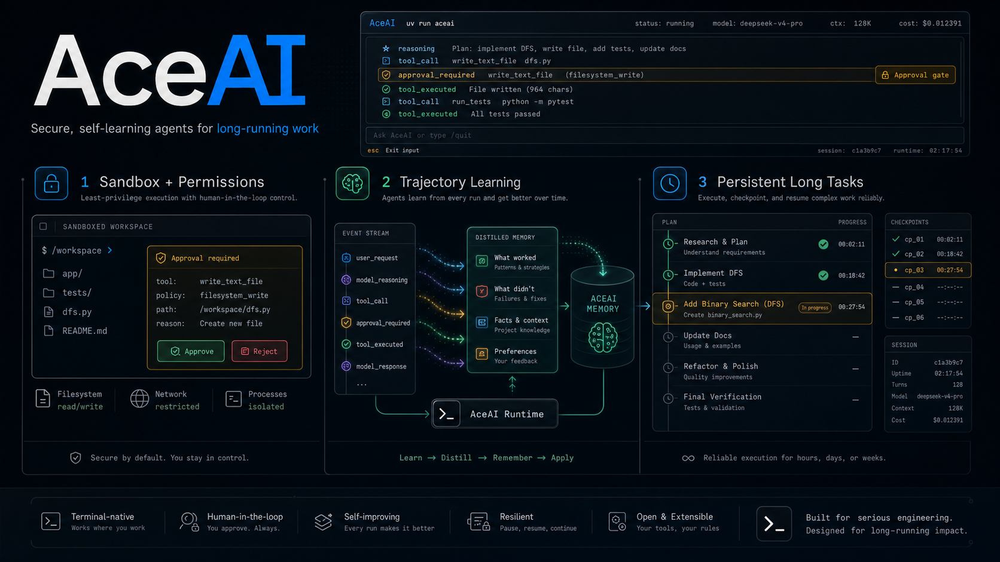
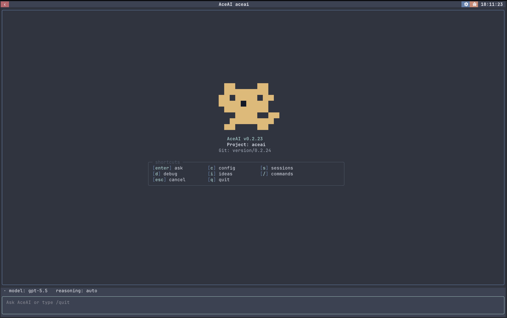
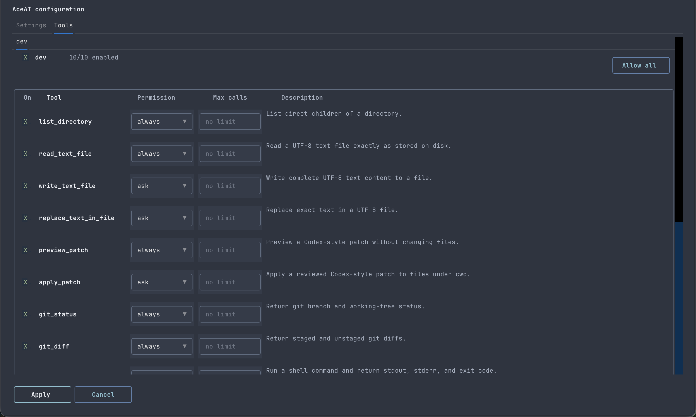
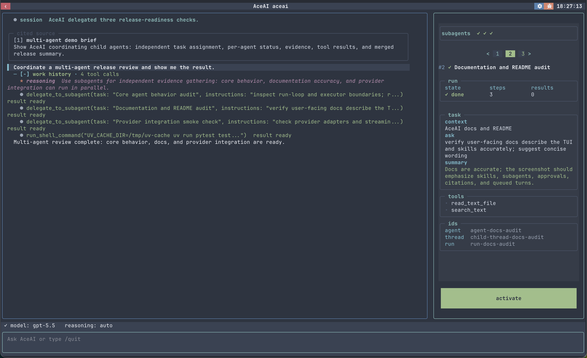
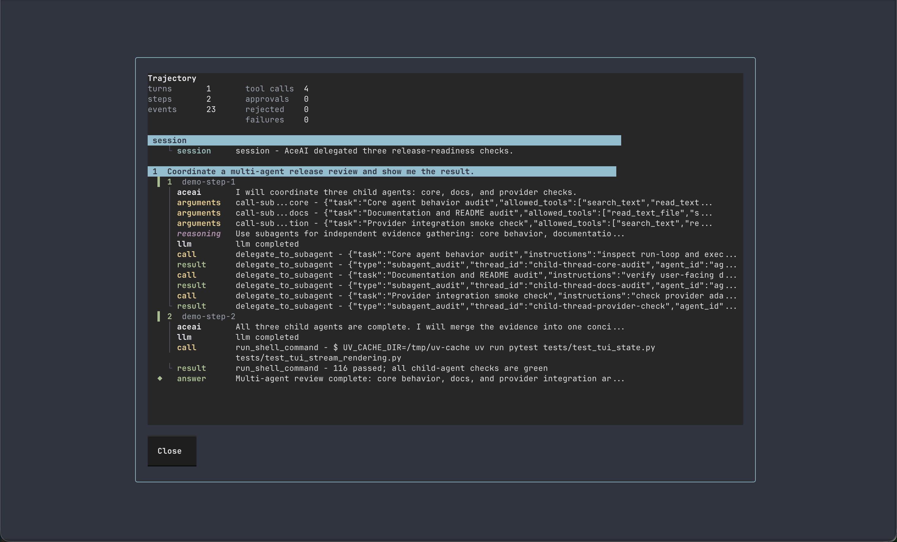
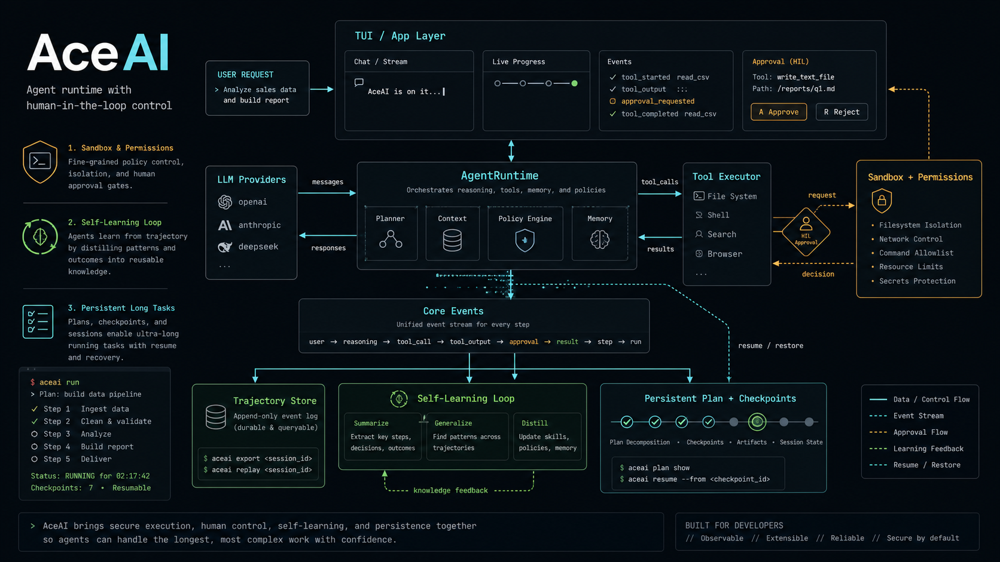

# AceAI



An engineering-first agent framework and terminal agent app for serious coding
work: strict tool contracts, durable multi-agent sessions, provider-aware
runtime controls, and OTLP-friendly tracing.

## Requirements & install
- Python 3.12+.

Use AceAI as a framework:

```bash
uv add aceai
```

This installs the core framework APIs without the terminal UI dependencies.

Use AceAI as a ready-made terminal app:

```bash
uv tool install "aceai[tui]"
```

This installs the TUI dependencies as a uv tool and exposes the `aceai`
command, giving you the full local terminal agent rather than only the framework
APIs. To run it once without installing the command:

```bash
uvx --from "aceai[tui]" aceai
```

If an older tool install starts with a missing dependency error after a source
checkout or upgrade, refresh the tool environment:

```bash
uv tool install --force --refresh-package aceai "aceai[tui]"
```

## Terminal UI



After installing the tool, set `OPENAI_API_KEY`, then launch the TUI directly:

```bash
aceai
```

Set `ACEAI_MODEL` or pass `--model` to choose the default OpenAI model.
If no API key is available, the TUI asks for provider settings and lets you
choose whether to persist them to `.aceai/config.yml`. On startup AceAI reads
project config first, then falls back to `~/.aceai/config.yaml`.
The TUI surfaces streaming work history, skill loading, tool calls, approval
gates, subagent progress, cited file and idea context, queued follow-up turns,
session resume/export, token/cost status, and per-tool permissions: `always`
runs without approval, `ask` uses the approval flow, and disabled tools are
hidden from the model. User turns render as a full-width prompt bar with
breathing room around the message, and queued turn controls stay aligned at the
right edge so steering and cancel actions are easy to scan even when messages
contain wide characters.
Provider, model, reasoning level, context compression, API timeout, streaming
startup timeout, streaming idle timeout, skills, and tool policies are all
configurable from the app and persisted in AceAI config. The provider catalog
tracks OpenAI, Codex subscription auth, DeepSeek, Anthropic API keys, and
Anthropic OAuth, including model context windows, reasoning controls, and
pricing metadata where available.

### Skills and tool permissions



The configuration screen keeps agent skills and local tools visible in one
place. Skills show their source, description, and filesystem path, while tool
groups can be enabled, capped, or switched to approval-free execution.
Tool configuration is part of the app boundary: filesystem, shell, search,
browser, memory, artifact, and hosted tools are loaded explicitly so the model
only sees the capabilities the app chooses to expose.

### Multi-agent work



AceAI can delegate independent checks to child agents, track their status, keep
their evidence separate, and merge compact completed handoffs back into the main
conversation. Use `delegate_to_subagent` when the parent needs an answer before
continuing, or start non-blocking jobs with `spawn_subagent`, `check_subagent`,
`wait_subagent`, `cancel_subagent`, and `collect_subagent_results` when the main
agent can keep working.

Child threads keep their own histories, artifacts, and statuses instead of
disappearing into one giant tool result. Background subagents can notify the
parent through the agent inbox when work completes, fails, or is canceled; those
inbox items are persisted, rendered in the TUI, and delivered into the next safe
model step as bounded context.

### Trajectory view



The trajectory view is a chronological audit trail of the run: turns, steps,
LLM deltas, tool calls, tool results, approvals, failures, and final answers.
It is useful when you need to debug exactly how a response was produced. For
large tool or subagent outputs, AceAI keeps compact model-facing handoffs while
preserving fuller audit artifacts for inspection, replay, and export.

## Architecture layers



AceAI has three layers. Start from the lowest layer that gives you what you
need:

```text
aceai.agent  app layer      run AceAI as a ready-made app
aceai.core   agent layer    build your own tool-using agents
aceai.llm    LLM layer      call LLM providers directly
```

If you only need provider-neutral LLM calls, use `aceai.llm`:

```python
from aceai.llm import LLMMessage, LLMService
from aceai.llm.openai import OpenAI
```

If you want to build your own agent with tools, use the core APIs:

```python
from aceai import Agent, Executor, spec, tool
```

If you just want to use AceAI as an app, do not import anything; run the CLI:

```bash
aceai
```

Long conversations use semantic context compaction at run and step boundaries,
so AceAI can summarize completed work without splitting provider tool-call
history. Transcript and export history remain complete; only the model-facing
context is bounded.

## Why another framework?
- Precise tool calls: force `typing.Annotated` + structured schemas; no broad “magic” unions.
- Engineer-friendly: dependency injection, strict msgspec decoding, surface errors instead of hiding them.
- Observable by default: emits OpenTelemetry spans; you configure the SDK/exporter however you like (OTLP/Langfuse/etc.).
- Predictable: explicit tool/provider registration; no hidden planners or silent fallbacks.

## Quick start

Define tools with strict annotations, wire a provider, executor, and agent.

```python
import json
from typing import Annotated
from msgspec import Struct, field
from openai import AsyncOpenAI

from aceai import Agent, Graph, LLMService, spec, tool
from aceai import Executor
from aceai.llm.openai import OpenAI


class OrderItems(Struct):
    order_id: str
    items: list[dict] = field(default_factory=list)


@tool
def lookup_order(order_id: Annotated[str, spec(description="Order ID like ORD-200")]) -> OrderItems:
    # Non-string returns are auto JSON-encoded
    return OrderItems(order_id=order_id, items=[{"sku": "sensor-kit", "qty": 2}])


def build_agent(api_key: str):
    graph = Graph()
    provider = OpenAI(
        client=AsyncOpenAI(api_key=api_key),
        default_meta={"model": "gpt-4o-mini"},
    )
    llm_service = LLMService(providers=[provider], timeout_seconds=60)
    executor = Executor(graph=graph, tools=[lookup_order])
    return Agent(
        sys_prompt="You are a logistics assistant.",
        default_model="gpt-4o-mini",
        llm_service=llm_service,
        executor=executor,
        max_steps=8,
    )
```

Plug your own loop/UI into `Agent`. See `examples/logistics_agent_demo.py` for a multi-tool async workflow.

## Concepts: workflow / agent / hybrid

### Workflow
A workflow is an LLM app where *you* own the control flow: what happens each step, the order, branching, and validation are all explicit in your code. The LLM is just one step (or a few steps) you call into.

In AceAI, implementing a workflow usually means calling `LLMService` directly:
- Use `LLMService.complete(...)` for plain text completion.
- Use `LLMService.complete_json(schema=...)` for structured steps, strictly decoding output into a `msgspec.Struct` (mismatches fail/retry).

Example: a two-stage workflow (extract structure first, then generate an answer).

```python
from msgspec import Struct
from openai import AsyncOpenAI

from aceai import LLMService
from aceai.llm import LLMMessage
from aceai.llm.openai import OpenAI


class Intent(Struct):
    task: str
    language: str


async def run_workflow(question: str) -> str:
    llm = LLMService(
        providers=[
            OpenAI(
                client=AsyncOpenAI(api_key="..."),
                default_meta={"model": "gpt-4o-mini"},
            )
        ],
        timeout_seconds=60,
    )

    intent = await llm.complete_json(
        schema=Intent,
        messages=[
            LLMMessage.build(role="system", content="Extract {task, language}."),
            LLMMessage.build(role="user", content=question),
        ],
    )

    resp = await llm.complete(
        messages=[
            LLMMessage.build(
                role="system",
                content=f"Answer the user. language={intent.language}; task={intent.task}.",
            ),
            LLMMessage.build(role="user", content=question),
        ],
    )
    return resp.text
```

### Agent
An agent is a workflow where the *LLM* owns the control flow: at each step it decides whether to call tools, which tool to call, and with what arguments. The framework executes tools, appends tool outputs back into context, and keeps the loop running until a final answer is produced.

In AceAI, building an agent is wiring three pieces:
- `LLMService`: talks to a concrete LLM provider (complete/stream/complete_json).
- `Executor`: strictly decodes explicit tool args, resolves DI, runs the tools you pass in, and encodes returns back to strings.
- `Agent`: runs the multi-step loop, maintains message history, orchestrates tool calls, and emits events.

Example: a minimal agent (one `add` tool).

```python
from typing import Annotated

from openai import AsyncOpenAI

from aceai import Agent, Graph, LLMService, spec, tool
from aceai import Executor
from aceai.llm.openai import OpenAI


@tool
def add(
    a: Annotated[int, spec(description="Left operand")],
    b: Annotated[int, spec(description="Right operand")],
) -> int:
    return a + b


def build_agent(api_key: str) -> Agent:
    graph = Graph()
    llm = LLMService(
        providers=[
            OpenAI(
                client=AsyncOpenAI(api_key=api_key),
                default_meta={"model": "gpt-4o-mini"},
            )
        ],
        timeout_seconds=60,
    )
    executor = Executor(graph=graph, tools=[add])
    return Agent(
        sys_prompt="You are a strict calculator. Use tools when needed.",
        default_model="gpt-4o-mini",
        llm_service=llm,
        executor=executor,
        max_steps=5,
    )
```

### Skills
A skill is a filesystem package of specialized instructions. Use skills for workflows that are too large or too situational to keep in the base system prompt: release playbooks, document editing rules, browser-debugging recipes, project-specific coding conventions, and similar reusable knowledge.

Each skill lives in its own directory and must include a `SKILL.md` file with YAML frontmatter:

```text
skills/
  release/
    SKILL.md
    references/
      checklist.md
    scripts/
      prepare_release.py
    assets/
      template.json
```

```markdown
---
name: release
description: Use for release preparation, changelog checks, version bumps, and release PRs.
---

# Release workflow

Follow the release checklist in `references/checklist.md` when the user asks to prepare a release.
```

AceAI loads only skill metadata at agent startup. The full instruction body and supporting files are loaded later through tools, so large skill packages do not all enter the context window up front.

Configure skills on `Executor`, then pass that executor into `Agent`:

```python
executor = Executor(
    graph=graph,
    tools=[],
    skill_path="auto",
)

agent = Agent(
    prompt="You are a release assistant.",
    default_model="gpt-4o-mini",
    llm_service=llm,
    executor=executor,
)
```

Set `skill_path="disable"` on `Executor` to turn skill loading off completely. This skips both global and project skills and does not register `skills_list` or `skill_view`.

When `skill_path="auto"`, AceAI scans:

- `~/.aceai/skills`
- `.agents/skills` under the current working directory
- built-in AceAI app skills, when the app passes them to `Executor`

When `skill_path` is a path, AceAI scans:

- `~/.aceai/skills`
- the provided path
- built-in AceAI app skills, when the app passes them to `Executor`

The AceAI app ships with a built-in `$skill-creator` skill vendored from Anthropic's public Agent Skills repository. It is loaded by default for `build_ace_agent(...)`; use `skill_path="disable"` to turn off all skills, including built-ins.

For every loaded skill, AceAI injects a compact `<available_skills>` block into the system prompt and registers two skill tools on `Executor`:

- `skills_list`: list known skills and their metadata.
- `skill_view`: load a skill's full instructions, or load a supporting file inside that skill directory.

The expected flow is progressive disclosure:

1. The model sees skill names and descriptions.
2. If a task matches a skill, the model calls `skill_view(name=...)`.
3. AceAI reads the skill instructions from disk and returns them as a tool result.
4. The next model step uses those instructions to answer or continue calling tools.

Users can also mention a skill explicitly with `$skill_name`; the mention is visible to the model and should make selection unambiguous.

### Hybrid
The most common production shape is hybrid: keep the deterministic parts as a workflow (call `LLMService` directly; `complete_json` is great for strict I/O), and delegate open-ended reasoning + tool use to `Agent`.

A simple approach is to subclass `Agent`, add helper methods that call `LLMService` for pre/post-processing, then hand off to `super().ask(...)`:

```python
from msgspec import Struct

from aceai.core import Agent
from aceai.llm import LLMMessage


class Route(Struct):
    department: str


class RoutedAgent(Agent):
    async def classify(self, question: str) -> Route:
        return await self.llm_service.complete_json(
            schema=Route,
            messages=[
                LLMMessage.build(role="system", content="Classify department."),
                LLMMessage.build(role="user", content=question),
            ],
            metadata={"model": self.default_model},
        )

    async def ask(self, question: str, **request_meta) -> str:
        route = await self.classify(question)
        return await super().ask(f"[dept={route.department}] {question}", **request_meta)
```

## Features

### Tools-first
Params must be `typing.Annotated` with `spec(...)`; missing annotations fail at registration. The spec drives JSON Schema for LLM tools and docs.

Tutorial: annotate every tool parameter with a concrete type and `spec` metadata (description/alias/etc.). If you skip it, `tool(...)` raises at import time so mistakes are caught early.

```python
from typing import Annotated
from aceai import tool, spec

@tool
def greet(name: Annotated[str, spec(description="Person to greet")]) -> str:
    return f"hi {name}"

# If you write: def bad(x: int): ...  -> tool(bad) will raise due to missing Annotated/spec.
```

Provider schemas can be stricter than Python call signatures. The OpenAI provider emits strict tool schemas, so every declared parameter is listed as required in the provider-facing schema even when the Python function has a default value:

```python
@tool
def search_text(
    query: Annotated[str, spec(description="Literal text to search for")],
    path: Annotated[str, spec(description='Directory tree or file to search. Use "." unless the user specifies another path.')] = ".",
) -> list[str]:
    ...
```

The Python default still applies for direct calls, but an OpenAI tool call must include `path`. If a parameter has a default that the model should use when the user does not specify a value, say that in the parameter description.

AceAI does not ship filesystem or shell tools by default. If your agent should read files, edit files, search text, or run commands, define those tools in the calling application and pass them explicitly to `Executor`. This keeps OS permissions, path policy, sandboxing, and audit rules in the application boundary rather than the framework.

### Strict decoding & auto JSON encoding
msgspec Struct validation enforces input types; return values are auto JSON-encoded (works for Struct/dict/primitive). LLM tool arguments are decoded into the right shapes, and outputs are encoded back to strings.

```python
from msgspec import Struct, field
from typing import Annotated
from aceai import tool, spec

class User(Struct):
    id: int
    name: str
    tags: list[str] = field(default_factory=list)

@tool
def user_info(user_id: Annotated[int, spec(description="User id")]) -> User:
    # Returning Struct is fine; executor encodes to JSON string.
    return User(id=user_id, name="Ada", tags=["admin"])

# When LLM emits {"user_id":"not-int"}, msgspec decode raises immediately.
# When tool returns User(...), executor returns '{"id":1,"name":"Ada","tags":["admin"]}'.
```

### Dependency injection (`ididi.use`)
Mark dependencies with `ididi.use(...)`; the executor resolves them before invocation, so tools stay pure. A realistic chain with nested deps:

```python
from typing import Annotated
from ididi import use
from aceai import tool, spec


class AsyncConnection:
    async def execute(self, query: str, params: dict) -> dict:
        return {"order_id": params["order_id"], "status": "created"}


async def get_conn(
    engine: Annotated[AsyncEngine, use(get_async_engine)]
) -> AsyncGenerator[AsyncConnection, None]:
    async with engine.connect() as conn:
        yield conn


class OrderRepo:
    def __init__(self, conn: AsyncConnection):
        self.conn = conn

    async def create(self, order_id: str, items: list[dict]) -> dict:
        return await self.conn.execute(
            "INSERT INTO orders VALUES (:order_id, :items)",
            {"order_id": order_id, "items": items},
        )


def build_repo(conn: Annotated[AsyncConnection, use(get_conn)]) -> OrderRepo:
    return OrderRepo(conn)


class OrderService:
    def __init__(self, repo: OrderRepo):
        self.repo = repo

    async def create_order(self, order_id: str, items: list[dict]) -> dict:
        return await self.repo.create(order_id, items)


def build_service(repo: Annotated[OrderRepo, use(build_repo)]) -> OrderService:
    return OrderService(repo)


@tool
async def create_order(
    order_id: Annotated[str, spec(description="New order id")],
    items: Annotated[list[dict], spec(description="Line items")],
    svc: Annotated[OrderService, use(build_service)],
) -> dict:
    return await svc.create_order(order_id, items)

```

Executor resolves AsyncConnection -> OrderRepo -> OrderService before invoking the tool.

### Observability (OpenTelemetry)
AceAI emits OpenTelemetry spans around agent steps, LLM calls, and tool calls. Configure OpenTelemetry natively (install the SDK/exporter as needed, e.g. `uv add 'aceai[otel]'`), then pass a tracer (or rely on the global tracer provider).

#### Example: Langfuse (OTLP HTTP)
```python
import base64

from opentelemetry import trace
from opentelemetry.exporter.otlp.proto.http.trace_exporter import OTLPSpanExporter
from opentelemetry.sdk.trace import TracerProvider
from opentelemetry.sdk.trace.export import BatchSpanProcessor

PUBLIC_KEY = "pk-lf-xxxx"
SECRET_KEY = "sk-lf-xxxx"
auth = base64.b64encode(f"{PUBLIC_KEY}:{SECRET_KEY}".encode()).decode()

otel_provider = TracerProvider()
exporter = OTLPSpanExporter(
    # EU:
    endpoint="https://cloud.langfuse.com/api/public/otel/v1/traces",
    # US:
    # endpoint="https://us.cloud.langfuse.com/api/public/otel/v1/traces",
    headers={"Authorization": f"Basic {auth}"},
)
otel_provider.add_span_processor(BatchSpanProcessor(exporter))
trace.set_tracer_provider(otel_provider)

tracer = trace.get_tracer("aceai-app")

llm_service = LLMService(providers=[provider], timeout_seconds=60)
executor = Executor(graph=graph, tools=[greet], tracer=tracer)
agent = Agent(..., tracer=tracer)
```

#### Example: configure via env vars
```bash
export OTEL_EXPORTER_OTLP_ENDPOINT="https://cloud.langfuse.com/api/public/otel"
export OTEL_EXPORTER_OTLP_HEADERS="Authorization=Basic <base64(pk:sk)>"
```

```python
from opentelemetry import trace
from opentelemetry.exporter.otlp.proto.http.trace_exporter import OTLPSpanExporter
from opentelemetry.sdk.trace import TracerProvider
from opentelemetry.sdk.trace.export import BatchSpanProcessor

otel_provider = TracerProvider()
otel_provider.add_span_processor(BatchSpanProcessor(OTLPSpanExporter()))
trace.set_tracer_provider(otel_provider)
```

#### Example: tests (InMemorySpanExporter)
```python
from opentelemetry import trace
from opentelemetry.sdk.trace import TracerProvider
from opentelemetry.sdk.trace.export import InMemorySpanExporter, SimpleSpanProcessor

exporter = InMemorySpanExporter()
otel_provider = TracerProvider()
otel_provider.add_span_processor(SimpleSpanProcessor(exporter))
trace.set_tracer_provider(otel_provider)

# ...run your agent...
spans = exporter.get_finished_spans()
```

### Completion semantics
An agent run completes when the model returns a step with **no tool calls**; that step's `LLMResponse.text` is treated as the final answer (and can be streamed via `response.output_text.delta`).

## Code notes & caveats
- **Tool signatures**: keep types concrete; no broad unions. Unannotated params raise immediately.  
  ```python
  # Incorrect: missing Annotated/spec
  def bad(x: int): ...

  # Incorrect: overly broad type
  def maybe(val: Any): ...

  # Correct
  def good(x: Annotated[int, spec(description="Left operand")]) -> int:
      return x
  ```
- **Return encoding**: `str`/`int`/`Struct`/`dict` are encoded to JSON before sending to the LLM.  
  ```python
  # Incorrect: double encoding (LLM sees quoted JSON)
  return json.dumps({"a": 1})

  # Correct: executor encodes once
  return {"a": 1}
  # or
  return User(id=1)
  ```

- **Tracing**: AceAI emits OpenTelemetry spans; configure `TracerProvider`/exporter natively (no AceAI wrapper), then pass a `tracer=...` into `LLMService`/`Executor`/`Agent`.

- **Failure policy**: fail fast; no implicit retries for tools. LLM retries are up to you.
- **OpenAI dependency**: only needed if you use the OpenAI provider or `examples/logistics_agent_demo.py`; importing that provider without the SDK will raise a missing dependency error.

## Extensibility

### Custom LLM provider
AceAI is provider-agnostic above the adapter boundary. To support another LLM vendor, implement `LLMProviderBase`, translate AceAI's provider-neutral request/response models to that vendor's SDK, then inject the provider into `LLMService`.

The provider contract is deliberately small:

- `complete(request: LLMInput) -> LLMResponse`: one-shot completion.
- `stream(request: LLMInput) -> AsyncGenerator[LLMStreamEvent, None]`: streaming text/tool/media events.
- `modality -> LLMProviderModality`: declare supported input/output modalities.
- `stt(...) -> str`: speech-to-text. If your provider does not support it, implement the method and raise `NotImplementedError`.

Minimal skeleton:

```python
from collections.abc import AsyncGenerator
from typing import BinaryIO

from aceai.llm import LLMInput, LLMProviderBase, LLMResponse
from aceai.llm.models import LLMProviderModality, LLMStreamEvent


class MyProvider(LLMProviderBase):
    def __init__(self, client: MyVendorClient, *, default_model: str) -> None:
        self.client = client
        self.default_model = default_model

    @property
    def modality(self) -> LLMProviderModality:
        return LLMProviderModality(text_in=True, image_in=False, image_out=False)

    async def complete(self, request: LLMInput) -> LLMResponse:
        # Translate request["messages"], request.get("tools"), and request.get("metadata")
        # into your vendor's payload shape.
        result = await self.client.complete(
            model=request.get("metadata", {}).get("model", self.default_model),
            messages=request["messages"],
        )
        return LLMResponse(
            id=result.id,
            model=result.model,
            text=result.text,
        )

    async def stream(
        self,
        request: LLMInput,
    ) -> AsyncGenerator[LLMStreamEvent, None]:
        async for chunk in self.client.stream(
            model=request.get("metadata", {}).get("model", self.default_model),
            messages=request["messages"],
        ):
            yield LLMStreamEvent(
                event_type="response.output_text.delta",
                text_delta=chunk.text,
            )

        yield LLMStreamEvent(
            event_type="response.completed",
            response=LLMResponse(text=""),
        )

    async def stt(
        self,
        filename: str,
        file: BinaryIO,
        *,
        model: str,
        prompt: str | None = None,
    ) -> str:
        raise NotImplementedError
```

Then inject it exactly like the built-in OpenAI adapter:

```python
from aceai import Agent, Graph, LLMService
from aceai.core import Executor


provider = MyProvider(client=MyVendorClient(api_key="..."), default_model="vendor-large")
llm = LLMService(providers=[provider], timeout_seconds=60)
executor = Executor(graph=Graph(), tools=[])

agent = Agent(
    prompt="You are a helpful assistant.",
    default_model="vendor-large",
    llm_service=llm,
    executor=executor,
)
```

For agent/tool support, the provider also needs to map vendor tool calls into `LLMToolCall` and return them on `LLMResponse.tool_calls`. If your vendor expects a different tool schema envelope, implement a provider-specific `IToolSpec` renderer and attach it with `@tool(spec_cls=...)`; see the custom tool spec section below.

### Custom agent (subclass `Agent`)
In real products, the core reasoning loop is rarely the whole story: you often need to inject request metadata (tenant/user ids, model selection), enforce guardrails, integrate with your UI/event system, or standardize defaults across calls. Subclassing `Agent` lets you wrap those concerns around the existing streaming + tool-execution loop without re-implementing it; `Agent` already owns message assembly, step bookkeeping, and calling into `LLMService` and the `Executor`, so delegating to `super()` keeps the behavior consistent while you add your glue. This is usually the best place to customize because it keeps product policy at the boundary and leaves your tools/providers reusable and easy to test.

```python
from aceai.core import Agent
from aceai.llm.models import LLMRequestMeta
from typing import Unpack

class MyAgent(Agent):
    async def ask(self, question: str, **request_meta: Unpack[LLMRequestMeta]) -> str:
        # e.g., enforce defaults / attach metadata for every request
        request_meta.setdefault("model", self.default_model)
        return await super().ask(question, **request_meta)
```

### Custom executor (subclass `Executor`)
Tool calls are a natural choke point for governance: you may want to enforce an allowlist, apply rate limits, add audits, or redact arguments before storing them. Subclass `Executor` and override `execute` to add pre/post hooks, then delegate to `super().execute` so you still benefit from AceAI’s standard argument decoding, dependency resolution, and return encoding. Centralizing policies here is typically better than sprinkling checks across tools because it keeps tools small and makes rules consistent across the entire tool surface.

```python
from aceai import Executor
from aceai.llm.errors import AceAIValidationError

class AuditedExecutor(Executor):
    async def execute(self, invocation, *, tool_state):
        # pre-hook (e.g., allowlist)
        if invocation.call.name not in {"lookup_order", "create_order"}:
            raise AceAIValidationError(f"Tool not allowed: {invocation.call.name}")
        result = await super().execute(invocation, tool_state=tool_state)
        # post-hook (e.g., audit log / metrics)
        return result
```

### Custom tool spec (provider schema)
When integrating a new provider, the mismatch is often the *schema envelope* rather than your tool logic: some providers want `parameters`, others want `input_schema`, some require extra flags, and some wrap tools differently. AceAI separates signature extraction (`ToolSignature` built from `typing.Annotated` + `spec`) from schema rendering; implementing `IToolSpec.generate_schema()` lets you map the same underlying JSON Schema to whatever shape your provider expects, and you can attach that renderer per tool via `@tool(spec_cls=...)`. This is the cleanest way to support multiple providers because you don’t touch tool code or signature parsing—only the adapter changes.

```python
from typing import Annotated
from aceai import tool, IToolSpec, spec

class MyProviderToolSpec(IToolSpec):
    def __init__(self, *, signature, name, description):
        self.signature = signature
        self.name = name
        self.description = description

    def generate_schema(self):
        return {
            "name": self.name,
            "description": self.description,
            "params": self.signature.generate_params_schema(),
            "type": "custom",
        }

@tool(spec_cls=MyProviderToolSpec)
def hello(name: Annotated[str, spec(description="Name")]) -> str:
    return f"hi {name}"

# If your provider needs different field names (e.g., "input_schema" instead of "parameters"),
# implement that in generate_schema() here without touching the rest of the agent stack.
```

See `examples/logistics_agent_demo.py` for a full multi-tool agent and `agent.ipynb` for an end-to-end notebook walkthrough.
